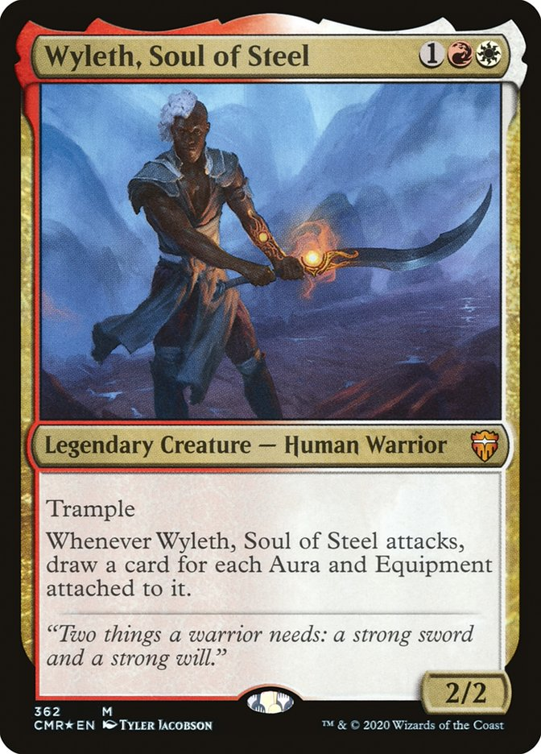
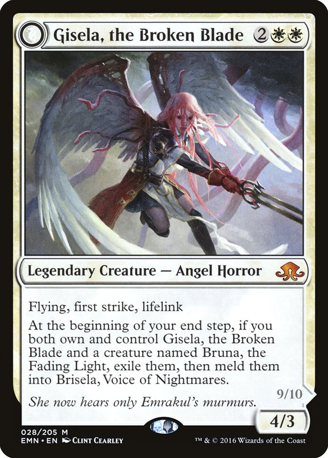

# Rules

* 540 card cube
* 60 card decks
* 3 packs of 21 cards

* Conspiracies
* Draft-matters cards
* Custom relics

# Archetypes

There are a number of core archetypes which should be available to all drafters.

* Card draw
* Ramp
* Control
* Aggro

For each guild, a specific primary and secondary archetype.

## <i class="ms ms-wu ms-cost"></i> Azorius
* Flicker
* Control

## <i class="ms ms-ub ms-cost"></i> Dimir
* Rogue tribal
* Faerie tribal
* Mill
  

## <i class="ms ms-br ms-cost"></i> Rakdos
* Madness
* Aristocrats

## <i class="ms ms-rg ms-cost"></i> Gruul
* Landfall aggro
* Land destruction

## <i class="ms ms-gw ms-cost"></i> Selesnya
* Enchantress
* Tokens

## <i class="ms ms-wb ms-cost"></i> Orzhov
* Cleric tribal
* Lifegain

## <i class="ms ms-bg ms-cost"></i> Golgari
* -1/-1 counters (Wither/Infect)
* Life Drain
  

## <i class="ms ms-gu ms-cost"></i> Simic
* +1/+1 counters
* Proliferate

## <i class="ms ms-ur ms-cost"></i> Izzet
* Prowess/Spellslinger
* Pirate tribal

## <i class="ms ms-rw ms-cost"></i> Boros
* Voltron
* Vehicles

## <i class="ms ms-c ms-cost"></i> Colourless
* Eldrazi tribal
* Control

## <i class="ms ms-multicolor ms-cost ms-duo ms-duo-color ms-grad"></i> WUBRG
* Domain
* Converge

## Extra tribes
* Angel
* Dragon
* Demon

## Extra themes
* Monarch
* Partner
